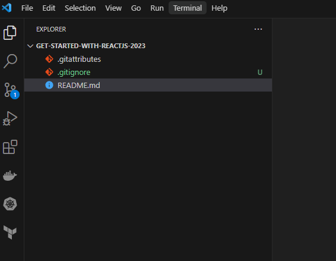
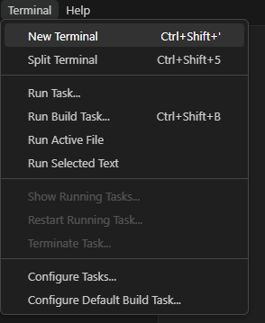
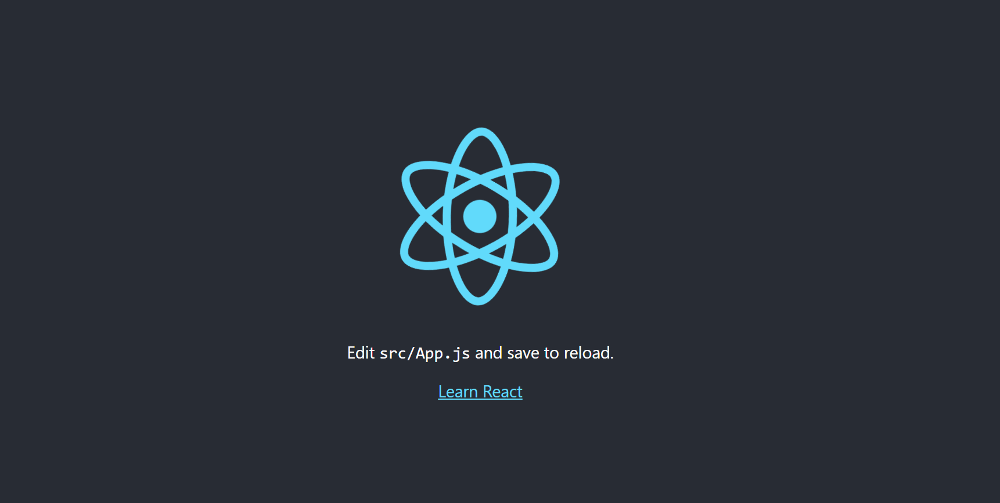

## **Get Started with ReactJS 2023**
With TailwindCSS integration

---


You will need:
- Node
- Node Package Manager (NPM)
- Node Package Executor (NPX)

Finished Links:
- [Github](https://github.com/mo-justlearnai/Get-Started-with-ReactJS-2023)

## **[What is React?](https://react.dev/)**  

## **[1. Download Node](https://nodejs.org/en/download/current)**

You can decide whether to install the Current or LTS (Long Term Support) versions. I have found both work just as well for use cases I have worked on thus far. 

Download Node for you Operating system.

Follow all default configuration with Node.js Setup... meaning you don't need to uncheck or check anything... leave all as is. 

## **2. Confirm Node & NPM & NPX Installation**

Before creating our react app, we will confirm both node and npm are installed on our computers. 

I am working in VSCode to develop this. 
[Download VS Code](https://code.visualstudio.com/)

Start a New PowerShell Terminal in VS Code





**Run**

```shell
node -v
# v20.3.1
```

```shell
npm -v   
# 9.6.7
```

```shell
npx -v   
# 9.6.7
```

## **3. Building React App**

We will use NPX that is bundled with NPM to execute packages for us... it installs react, react-dom and react scripts for us.  
Any further packages we want to install will be managed by NPM i.e you and I.

Run the below command and wait some time for NPX to finish executing it shouldn't take longer than 2 - 3 minutes. 

I have named my project: reactapp

```shell
npx create-react-app reactapp
```

Change your directory to the name of your project/app

```shell
cd reactapp
```

Run npm start to run the app in development mode

```shell
npm start
```

http://localhost:3000/ should have automatically opened after running the above command.


## **[4. Installing TailwindCSS](https://tailwindcss.com/docs/installation)**

Ensure all following commands are run in the working directory of your react app

Install tailwind via npm
```shell
npm install -D tailwindcss
```

Created the tailwind.config.js file which is the key to custom CSS with react and tailwindcss
```shell
npx tailwindcss init
```

Change the contents of your tailwind.config.js file to the below.
The below includes tailwind for jsx and typescript if you choose to use that within your project.

```js
/** @type {import('tailwindcss').Config} */
module.exports = {
  content: ["./src/**/*.{js,jsx,ts,tsx}"],
  theme: {
    extend: {},
  },
  plugins: [],
}
```

Add the @tailwind directives for each of Tailwind’s layers to your main CSS file.

```css
@tailwind base;
@tailwind components;
@tailwind utilities;
```

## **[5. CSS Demo](https://tailwindcss.com/docs/installation)**

To build the following I installed 1 extra package, react-router-dom to handle routing in the app. 

Run the command below to install react-router-dom

```shell
npm i react-router-dom
```


Thanks for reading.

---
<!-- DONE -->


